# ALS Recommender System from Scratch

A large-scale movie recommender built around **Alternating Least Squares (ALS)**, implemented directly with **NumPy + Numba** rather than through a recommender-system library.

This project started as part of the **Applied ML at Scale** course at AIMS South Africa. The main goal was not only to obtain a good RMSE, but to understand what the model is doing: how user/item bias affects recommendations, how latent dimension controls overfitting, how genre information helps cold-start items, and how an ALS recommendation can be explained from a user's past ratings.

The repository contains the full path from data preparation to model training, analysis, explanations, and a small Gradio application.

<p align="center">
  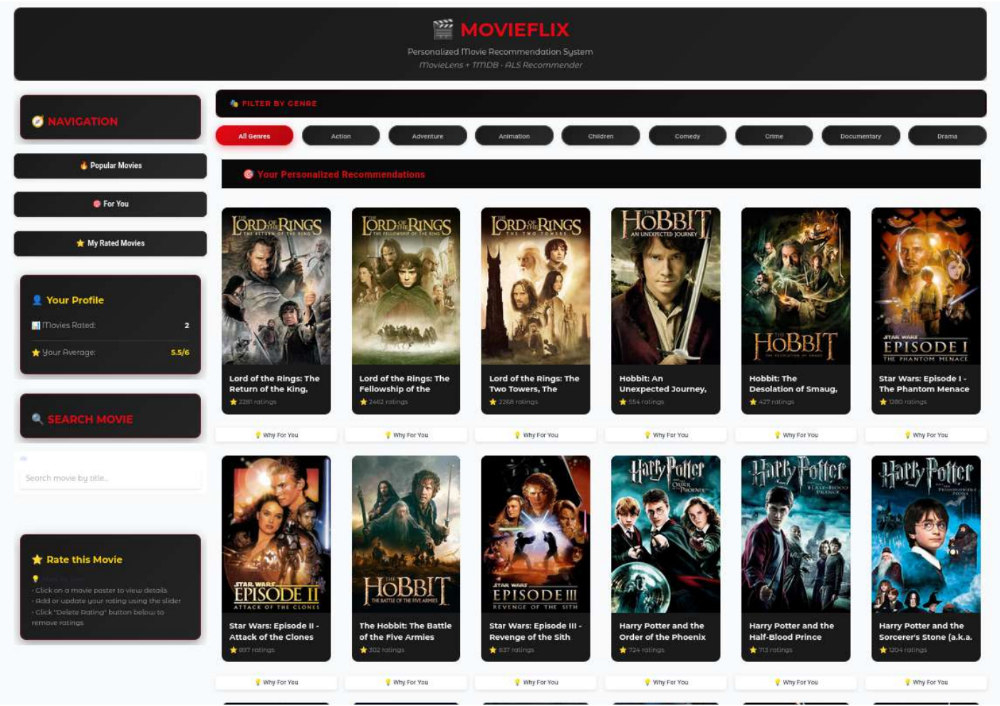
</p>
Website: https://aims-course-service-aimeloick-aims-ai-186773437176.europe-west2.run.app/app_scale/

---

## What is implemented

The repository contains three progressively richer models:

1. **Bias-only model** — learns how generous/strict each user is and how highly/poorly each movie tends to be rated.
2. **ALS matrix factorization** — adds latent user and item vectors learned from ratings.
3. **ALS + genre embeddings** — ties item vectors to learned genre representations to provide useful structure when an item has few ratings.

The experiments also include:

- per-user train/test splitting;
- hyperparameter search with Optuna;
- latent-dimension / overfitting analysis;
- item polarization analysis;
- a dummy-user experiment based on *The Lord of the Rings*;
- recommendation explanations from historical items and item features;
- a Gradio-based recommender interface.

---

## Dataset

The experiments were developed with **MovieLens 32M**:

- **32 million ratings**
- **200,948 users**
- **87,585 movies**
- movie metadata including genres

The interaction matrix is extremely sparse and follows a clear long-tail structure: a relatively small number of users and movies account for a large share of the observed ratings.

<table>
<tr>
<td align="center">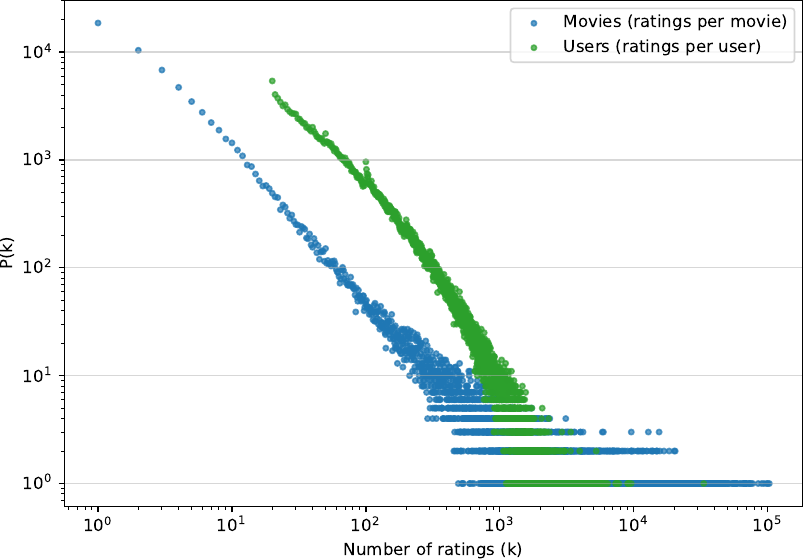<br><sub>Ratings per movie/user follow a heavy-tailed distribution.</sub></td>
<td align="center">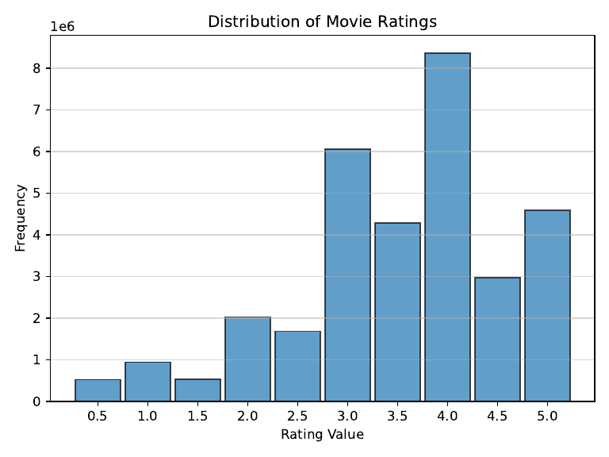<br><sub>Observed ratings are not uniformly distributed.</sub></td>
</tr>
</table>

The code keeps two sparse views of the same interactions:

- `data_by_user[u] -> [(item, rating), ...]`
- `data_by_movie[i] -> [(user, rating), ...]`

This makes the two alternating ALS updates efficient without building a dense user-item matrix.

---

## Model

Let

- $r_{ui}$ be the observed rating of user $u$ for item $i$;
- $\mathbf{u}_u \in \mathbb{R}^{K}$ be the latent vector of user $u$;
- $\mathbf{v}_i \in \mathbb{R}^{K}$ be the latent vector of item $i$;
- $b_u$ and $b_i$ be the user and item biases.

The prediction used by the core ALS model is

```math
\hat{r}_{ui}
=
\mathbf{u}_u^\top \mathbf{v}_i
+
b_u
+
b_i
```

The implementation minimizes the regularized objective

```math
\mathcal{L}
=
\frac{\lambda}{2}
\sum_{(u,i)\in\Omega}
\left(
r_{ui}
-
\mathbf{u}_u^\top \mathbf{v}_i
-
b_u
-
b_i
\right)^2
+
\frac{\tau}{2}
\left(
\sum_u \|\mathbf{u}_u\|_2^2
+
\sum_i \|\mathbf{v}_i\|_2^2
\right)
+
\frac{\gamma}{2}
\left(
\sum_u b_u^2
+
\sum_i b_i^2
\right)
```

Here:

- $K$ controls model capacity;
- $\lambda$ weights the rating reconstruction term;
- $\tau$ regularizes latent factors;
- $\gamma$ regularizes user/item biases.

### Why ALS?

The full problem is not jointly convex in $U$ and $V$. ALS makes it manageable by fixing one side and solving a regularized least-squares problem for the other.

For a fixed set of item vectors, the user update is

```math
\mathbf{u}_u
\leftarrow
\left(
\lambda
\sum_{i\in\Omega(u)}
\mathbf{v}_i\mathbf{v}_i^\top
+
\tau I
\right)^{-1}
\left(
\lambda
\sum_{i\in\Omega(u)}
(r_{ui}-b_u-b_i)\mathbf{v}_i
\right)
```

Likewise, for an item $i$,

```math
\mathbf{v}_i
\leftarrow
\left(
\lambda
\sum_{u\in\Omega(i)}
\mathbf{u}_u\mathbf{u}_u^\top
+
\tau I
\right)^{-1}
\left(
\lambda
\sum_{u\in\Omega(i)}
(r_{ui}-b_u-b_i)\mathbf{u}_u
\right)
```

The corresponding bias updates implemented in the code are

```math
b_u
\leftarrow
\frac{
\lambda
\sum_{i\in\Omega(u)}
\left(
r_{ui}
-
\mathbf{u}_u^\top \mathbf{v}_i
-
b_i
\right)
}{
\lambda|\Omega(u)| + \gamma
}
```

```math
b_i
\leftarrow
\frac{
\lambda
\sum_{u\in\Omega(i)}
\left(
r_{ui}
-
\mathbf{u}_u^\top \mathbf{v}_i
-
b_u
\right)
}{
\lambda|\Omega(i)| + \gamma
}
```

The actual linear solves are implemented in [`models/als_core.py`](models/als_core.py) and parallelized with Numba.

---

## Why start with biases?

Before learning latent factors, I trained a bias-only recommender:

```math
\hat{r}_{ui}=b_u+b_i
```

This simple model is useful because ratings contain strong systematic effects: some users almost always rate high, others low, and some movies receive consistently better ratings than others.

In the reported experiment, the bias-only baseline reached a test RMSE of approximately **0.8461**. It also converged very quickly.

<p align="center">
  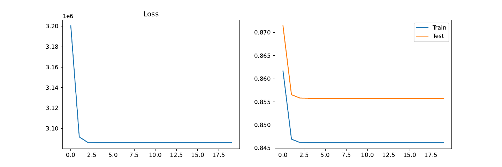
</p>

The full latent-factor model reduced the reported test RMSE to approximately **0.7692**.

<p align="center">
  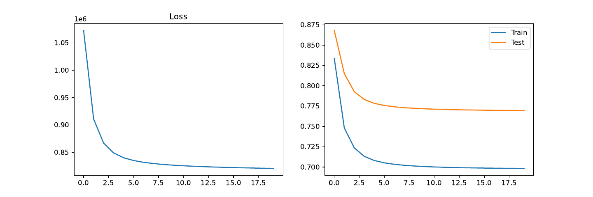
</p>

---

## Choosing the latent dimension

A larger latent space always gives the model more freedom on the training set. That does not mean it generalizes better.

I tested several values of $K$ and compared train/test RMSE. The test error improved strongly at first, but gains became small around the mid-teens while the train-test gap continued to grow. I therefore used **$K=15$** in the main experiments.

<table>
<tr>
<td align="center">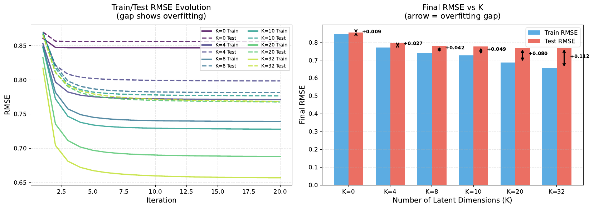<br><sub>RMSE as latent dimension increases.</sub></td>
<td align="center">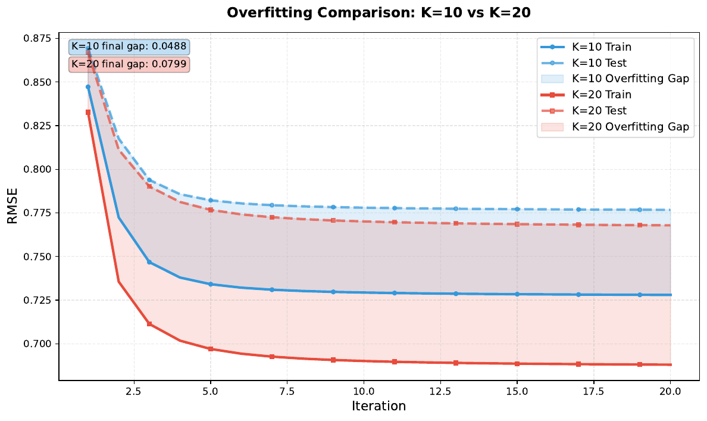<br><sub>Example of the larger train-test gap at K=20.</sub></td>
</tr>
</table>

The default parameters in the current main scripts are:

```python
factor_number = 15
lambda_val = 0.1
gamma = 0.04
tau = 1.9        # core ALS
tau = 2.1        # feature-aware ALS
n_iters = 20
```

These are experiment settings, not universal values for ALS.

---

## Cold start with genre embeddings

Pure collaborative filtering has a structural limitation: if a movie has very few ratings, there is little information from which to estimate its latent vector.

The feature-aware model learns a latent vector $\mathbf{f}_g$ for each genre and defines an item-side prior

```math
\mathbf{s}_i
=
\frac{1}{\sqrt{|F_i|}}
\sum_{g\in F_i}
\mathbf{f}_g
```

where $F_i$ is the set of genres associated with movie $i$.

The item vector is then encouraged to stay close to that feature representation:

```math
\frac{\tau}{2}
\sum_i
\left\|
\mathbf{v}_i - \mathbf{s}_i
\right\|_2^2
```

The implementation also regularizes the user and feature vectors. The item update therefore becomes, conceptually,

```math
\mathbf{v}_i
\leftarrow
\left(
\lambda
\sum_{u\in\Omega(i)}
\mathbf{u}_u\mathbf{u}_u^\top
+
\tau I
\right)^{-1}
\left[
\lambda
\sum_{u\in\Omega(i)}
(r_{ui}-b_u-b_i)\mathbf{u}_u
+
\tau\mathbf{s}_i
\right]
```

This gives low-degree items a meaningful prior instead of letting regularization simply collapse their vectors toward zero.

<p align="center">
  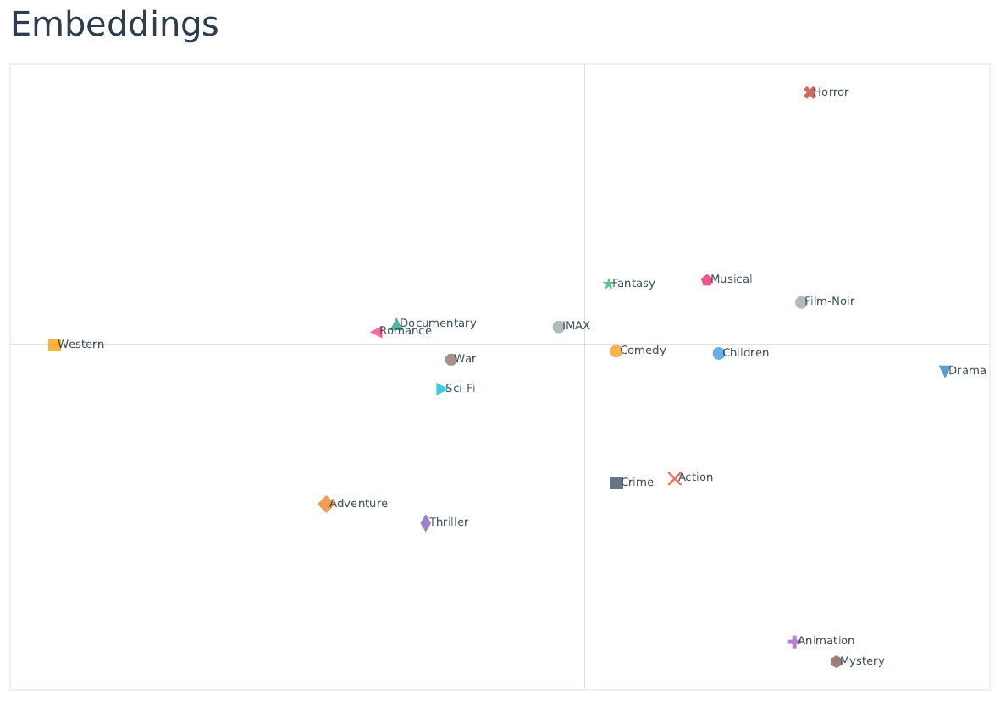
</p>

The 2-D plot is only a diagnostic view of a higher-dimensional representation, but it shows that some semantically related genres end up close in the learned latent space.

---

## Polarization analysis

I also used the latent vectors to study which movies are represented as particularly distinctive by the model.

The working definition used in the project is

```math
P_i = \|\mathbf{v}_i\|_2
```

A large norm means that the item lies far from the origin of the latent space and can therefore induce large positive or negative interactions depending on the user's direction.

One important observation is that **polarization and popularity are entangled** in plain ALS. Low-degree movies receive weak evidence and regularization pushes their vectors toward zero. The feature-aware model helps reduce this effect because even sparsely rated movies receive information from their genres.

<table>
<tr>
<td align="center">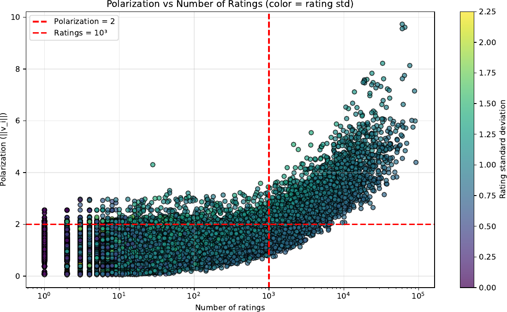<br><sub>Polarization versus number of ratings.</sub></td>
<td align="center">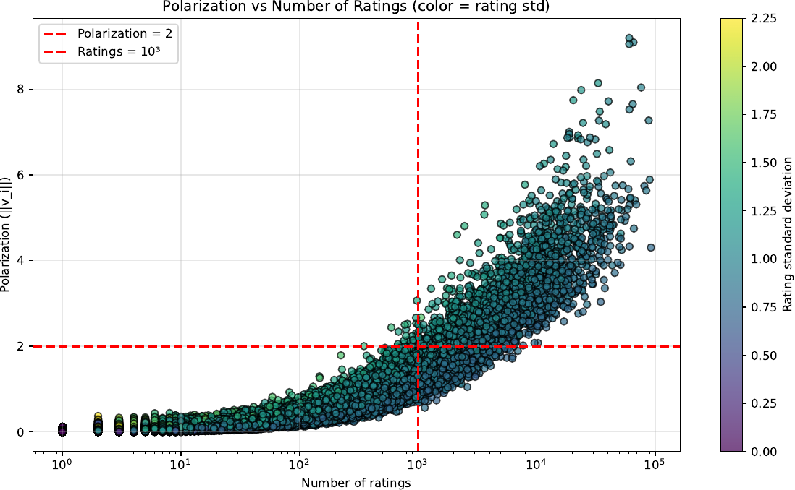<br><sub>Polarization with rating variability.</sub></td>
</tr>
</table>

This is why the repository keeps the polarization analysis separate in [`polarisation/`](polarisation/) rather than treating the latent norm as a direct ground-truth measure of disagreement.

---

## Recommendation experiment: a synthetic LOTR fan

To inspect the recommender beyond aggregate RMSE, I created a synthetic user who gives a rating of **5** to *The Lord of the Rings: The Two Towers (2002)*.

A new user vector is inferred from the rated item by solving the same regularized least-squares system used during ALS training.

For ranking, the standard score is

```math
s_i
=
\mathbf{u}^\top\mathbf{v}_i
+
b_i
```

I also tested a reduced item-bias score

```math
s_i^{(0.05)}
=
\mathbf{u}^\top\mathbf{v}_i
+
0.05\,b_i
```

because a large item bias can push globally popular movies upward even when their latent direction is less aligned with the user's profile.

The reduced-bias ranking produced a visibly more coherent fantasy / science-fiction neighborhood around the seed movie, including the LOTR trilogy, *The Hobbit*, and *Star Wars* titles in the reported experiment.

<p align="center">
  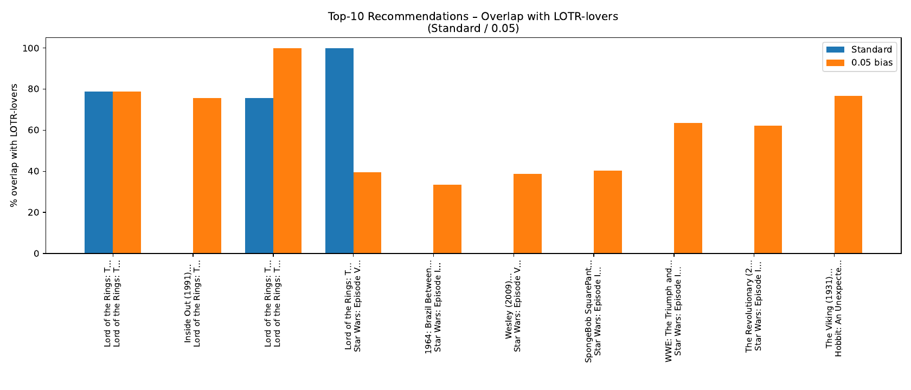
</p>

The code for this experiment is in [`main_prediction.py`](main_prediction.py), [`prediction/`](prediction/) and [`visualization/prediction.py`](visualization/prediction.py).

---

## Explaining an ALS recommendation

A recommender should not stop at *"you may like this movie"*. For debugging and for the user-facing application, I wanted to answer a more useful question:

> **Which movies you previously rated contributed most to this recommendation?**

For a user $u$, the explainer constructs

```math
A_u
=
\lambda
\sum_{j\in\Omega(u)}
c_{uj}
\mathbf{v}_j\mathbf{v}_j^\top
+
\tau I
```

and transforms the target item vector as

```math
\tilde{\mathbf{v}}_i
=
A_u^{-1}\mathbf{v}_i
```

The contribution of a previously rated item $j$ is then

```math
C_{j\rightarrow i}
=
\tilde{\mathbf{v}}_i^\top
\mathbf{v}_j
\,c_{uj}
```

In the current explainer, $c_{uj}$ can be taken either from the observed rating or as a binary interaction weight, depending on the explainer variant. The historical items are then sorted by contribution. See [`explainer/contribution_items_passed.py`](explainer/contribution_items_passed.py).

For the feature-aware model, a genre contribution is computed directly from the user's latent vector and the learned feature vector:

```math
C_{g\rightarrow i}
=
\mathbf{u}_u^\top
\left(
\frac{1}{\sqrt{|F_i|}}
\mathbf{f}_g
\right),
\qquad
g\in F_i
```

This is implemented in [`explainer/contribution_features.py`](explainer/contribution_features.py).

The intent is deliberately local and model-specific: explain the recommendation using the same latent factors that generated it, rather than adding a separate black-box explainer around ALS.

---

## Looking inside the latent space

The repository includes visualization scripts for both movie and genre embeddings. In two dimensions, some local structure is visible, although overlap is expected because the production model uses a larger latent dimension.

<p align="center">
  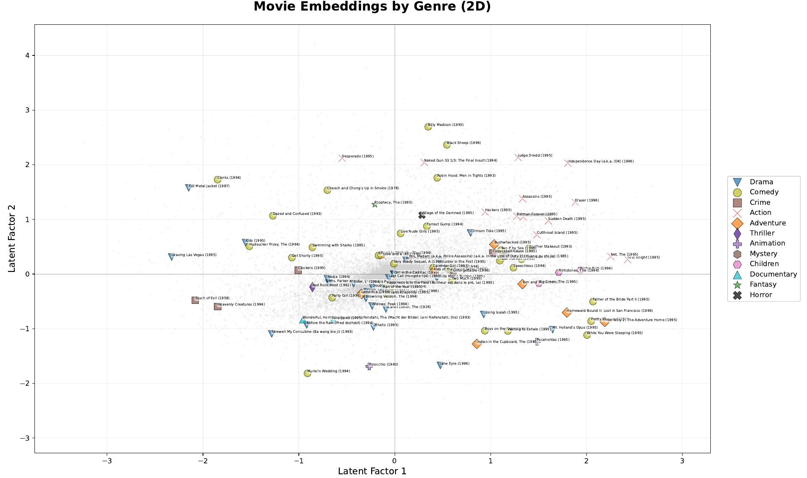
</p>

---

## Repository map

```text
ALS-Recommender-System-from-Scratch/
│
├── data/                       # Loading, indexing, splitting and genre features
│   ├── load_ratings.py
│   ├── split.py
│   ├── flatten.py
│   └── features.py
│
├── models/                     # Models implemented from scratch
│   ├── bias_only.py            # User/item-bias baseline
│   ├── als_core.py             # Core ALS updates + RMSE/loss
│   └── als_features.py         # ALS with learned genre embeddings
│
├── prediction/                 # New/dummy user construction and ranking
│   ├── dummy_user.py
│   └── recommend.py
│
├── explainer/                  # Local recommendation explanations
│   ├── contribution_items_passed.py
│   └── contribution_features.py
│
├── polarisation/               # Latent-vector norm analysis
│   └── top_polarisation.py
│
├── tuning/                     # K / tau / gamma experiments
│   ├── hierarchical.py
│   └── overfitting_checking.py
│
├── visualization/              # Figures used throughout the analysis
│   ├── loss_rmse_plots.py
│   ├── heatmaps.py
│   ├── plot_embedding_movie.py
│   ├── plot_embeddings_features.py
│   ├── polarisation.py
│   ├── prediction.py
│   └── ...
│
├── gradio/                     # MovieFlix user interface and cached metadata
│   └── main_gradio.py
│
├── pdf_reports/                # Generated experiment plots
│
├── main_bias.py                # Train the bias-only baseline
├── main_als.py                 # Train core ALS
├── main_als_feature.py         # Train feature-aware ALS
├── main_prediction.py          # Dummy-user + polarization experiments
├── main_prediction_feature.py  # Same analysis with feature-aware ALS
├── main_tuning.py              # Hyperparameter / K experiments
│
├── recommendation_als_code_notebook.ipynb
├── als_explainer_motebook.ipynb
└── als_model.pkl               # Serialized trained model used by the app
```

A few files under `evaluation/` and `utils/` are currently lightweight scaffolding; most of the active evaluation code is still called from the main experiment and visualization scripts.

---

## Where should I start?

If you want to understand the project rather than run everything blindly, I recommend this order:

| Goal | Start here |
|---|---|
| Understand how ratings are represented | [`data/load_ratings.py`](data/load_ratings.py) |
| Understand the split | [`data/split.py`](data/split.py) |
| See the simplest baseline | [`models/bias_only.py`](models/bias_only.py) |
| Read the ALS implementation | [`models/als_core.py`](models/als_core.py) |
| See how genre information enters ALS | [`models/als_features.py`](models/als_features.py) |
| Reproduce model training | [`main_als.py`](main_als.py) |
| Inspect K / overfitting | [`main_tuning.py`](main_tuning.py) |
| Understand ranking for a new user | [`prediction/recommend.py`](prediction/recommend.py) |
| Understand recommendation explanations | [`explainer/`](explainer/) |
| Launch the application | [`gradio/main_gradio.py`](gradio/main_gradio.py) |

---

## Running the project

### 1. Clone the repository

```bash
git clone https://github.com/aimeloick-aims-ai/ALS-Recommender-System-from-Scratch.git
cd ALS-Recommender-System-from-Scratch
```

### 2. Create an environment

```bash
python -m venv .venv
source .venv/bin/activate       # Linux / macOS
# .venv\Scripts\activate        # Windows
```

### 3. Install the main dependencies

The current `requirements.txt` is not yet populated, so install the packages used by the active code directly:

```bash
pip install numpy pandas numba matplotlib optuna tqdm gradio
```

Depending on which visualization / app path you run, additional packages may be required.

### 4. Add MovieLens 32M

The training scripts expect:

```text
ml-32m/
├── ratings.csv
└── movies.csv
```

The repository also contains `ml-latest-small/`, which is useful for quick experiments, but the reported large-scale results were produced with MovieLens 32M.

### 5. Train

Bias-only baseline:

```bash
python main_bias.py
```

Core ALS:

```bash
python main_als.py
```

ALS + genre embeddings:

```bash
python main_als_feature.py
```

Prediction / polarization experiment:

```bash
python main_prediction.py
```

### 6. Launch the app

```bash
python gradio/main_gradio.py
```

---

## Reproducibility notes

There are a few details worth knowing before comparing numbers exactly:

- The research report used a **per-user 80/20 train/test split**, while the current `data_split()` function defaults to `threshold=0.9`. Use `threshold=0.8` if you want to reproduce the report protocol.
- The data are shuffled before the split and the model is randomly initialized, so exact RMSE values can change unless seeds are fixed.
- `main_tuning.py` is experimental code; review the Optuna loop before using it for a fresh search.
- `requirements.txt` is currently empty.
- The reported numbers should therefore be read as results from the documented experiment, not as guaranteed output from every execution of the present repository state.

---

## Main observations from the project

- **Bias terms matter.** A substantial part of the rating signal is captured before any latent factors are introduced.
- **Latent factors improve accuracy substantially**, but increasing $K$ indefinitely mostly improves training fit and eventually increases the generalization gap.
- **Sparse users are harder.** Low-activity users show much less stable train/test behavior because their latent vectors are estimated from few observations.
- **Movie popularity can leak into ranking through item bias.** The LOTR dummy-user experiment made this especially visible.
- **Genre embeddings provide useful side information** for low-degree items and make the item representation less dependent on rating count alone.
- **ALS is interpretable enough to support native explanations.** Historical-item and feature contributions can be derived directly from the model's linear-algebra structure.

---

## Project context

This repository accompanies my work on **matrix factorization and latent-factor models for MovieLens recommendation systems with explainers**, developed during the Applied ML at Scale course at the African Institute for Mathematical Sciences (AIMS) South Africa.

The focus was deliberately broader than obtaining a leaderboard metric: I wanted to build the model from the equations, inspect its failure modes, and connect the trained system to explanations and an end-user application.

---

## Author

**Mahugnon Aime Loick Gohouede**  
AIMS South Africa

